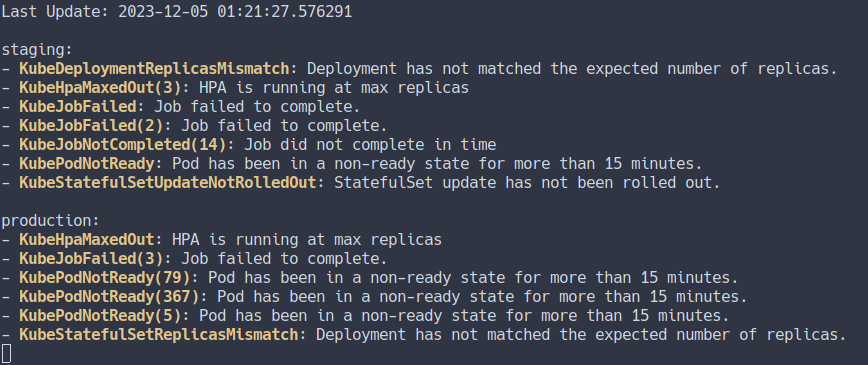
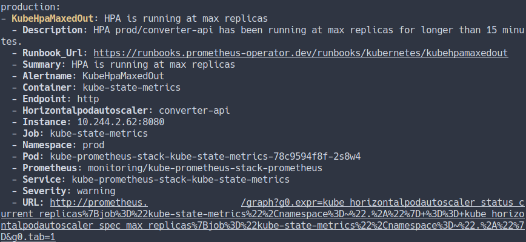

# tetik

Command line AlertManager monitor for multiple instances.




## Usage

```
pip install https://github.com/onur/tetik/archive/refs/heads/main.zip
python -m tetik --sources https://alertmanager.example.com
```

Or you can run it with docker:

```
docker run --rm -ti ghcr.io/onur/tetik --sources https://alertmanager.example.com
```


## Configuration

You can specify `--sources` or a `--config` file. tetik will try to load config
from `$HOME/.config/tetik.yaml` file if no sources provided. Format of `tetik.yaml`
file:

```yaml
sources:
- name: production
  url: https://alertmanager.production.example.com
  receivers: ['^((?!stackstorm).)*$']
- name: production-02
  url: https://alertmanager.staging.example.com
  receivers: ['^((?!stackstorm).)*$']
```

## Getting details of alerts

You can use `--details` argument to get details of an alert. You can also provide
multiple regular expressions for this argument to filter alerts.

```sh
python -m tetik --details KubeHpaMaxedOut
```




## Command line arguments

```
usage: __main__.py [-h] [-c CONFIG] [--sources SOURCES [SOURCES ...]] [--details [DETAILS ...]] [--timeout TIMEOUT] [--interval INTERVAL]

optional arguments:
  -h, --help            show this help message and exit
  -c CONFIG, --config CONFIG
                        config path
  --sources SOURCES [SOURCES ...]
                        alertmanager sources
  --details [DETAILS ...]
                        show alert details
  --timeout TIMEOUT     connection timeout
  --interval INTERVAL   seconds to wait between updates
```
